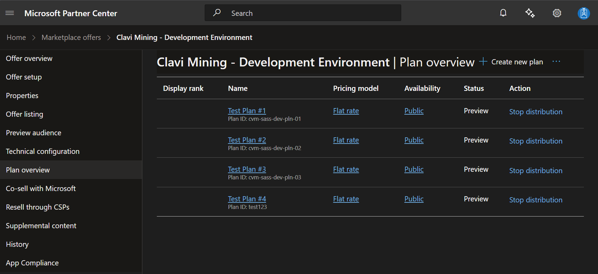
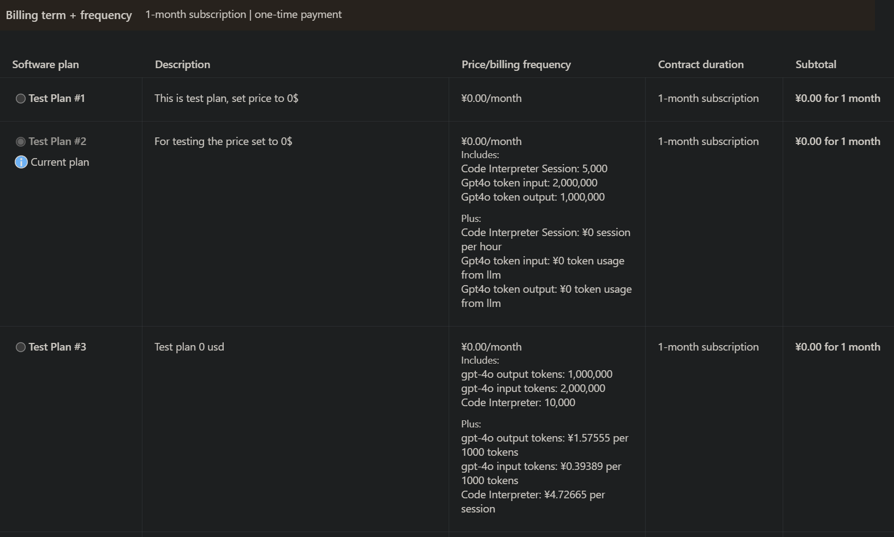
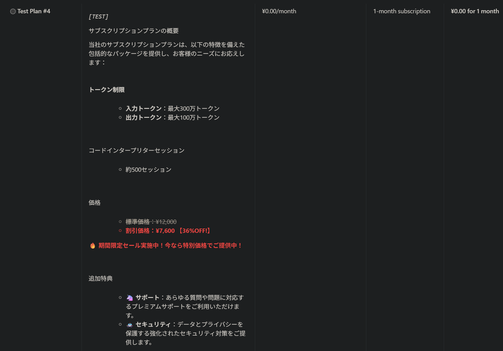
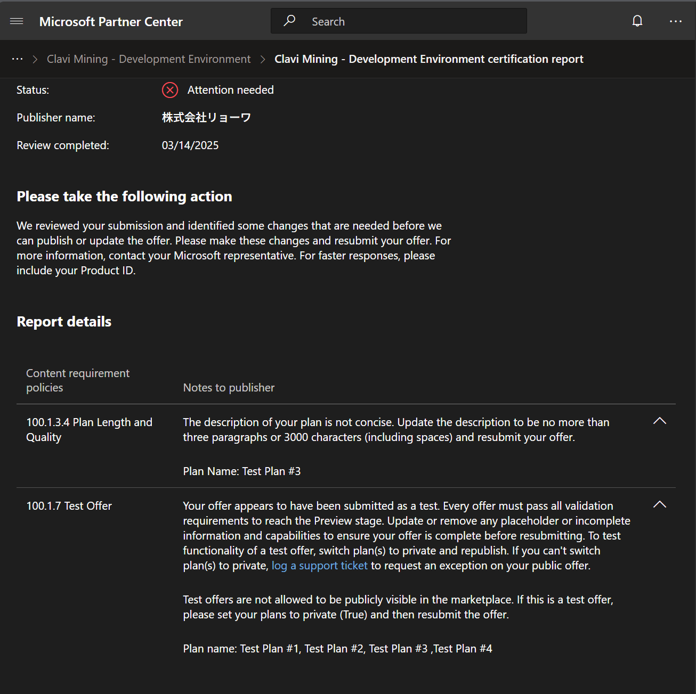

# ClaviMining Commercial Marketplace Implementation Guide

- [ClaviMining Commercial Marketplace Implementation Guide](#clavimining-commercial-marketplace-implementation-guide)
  - [How to Plan Offer](#how-to-plan-offer)
    - [Creating Marketplace Offer](#creating-marketplace-offer)
    - [Publishing offer](#publishing-offer)
  - [How to deployment and setting development environment](#how-to-deployment-and-setting-development-environment)
    - [Prerequisite](#prerequisite)
    - [Deployment](#deployment)
    - [Development Environment](#development-environment)
    - [Upgrade Matters](#upgrade-matters)

---

## How to Plan Offer

### Creating Marketplace Offer
Follow Microsoft's documentation for most of this process, as it mainly involves providing basic product information. The steps are straightforward, but pay special attention to the **Billing section**.

> Important Note: If you select "Metered" billing, be prepared for additional complexity. This billing model requires more configuration and understanding of usage reporting.







### Publishing offer
Before your offer can be published, ensure it meets all Microsoft's requirements. The platform will display any outstanding items that need attention:




## How to deployment and setting development environment

### Prerequisite
Bind an SSH key with your GitHub account when using Azure Cloud Shell.
```powershell
ssh-keygen
```

### Deployment
Simply run to install dotnet
```powershell
wget https://dotnet.microsoft.com/download/dotnet/scripts/v1/dotnet-install.sh; `
chmod +x dotnet-install.sh; `
./dotnet-install.sh -version latest; `
$ENV:PATH="$HOME/.dotnet:$ENV:PATH"; `
dotnet tool install --global dotnet-ef --version 8.0.0;
```
Clone beloved repository
```powershell
git clone -b WHATEVER_YOU_WANT git@github.com:RVisionSystem/ClaviMining_Commercial-Marketplace-SaaS-Accelerator.git
```
Run script deploy
```powershell
.\Deploy.ps1 `
 -WebAppNamePrefix "UNIQUE-NAME" `
 -ResourceGroupForDeployment "UNIQUE-RG-NAME" `
 -PublisherAdminUsers "SOMEONE@ryowa-inc.co.jp" `
 -Location "Japan East"
```

### Development Environment
Can setup after we deployment from previous state can watch [this tutorial](https://www.youtube.com/watch?v=H8p9n1bVTjY) just for referent

Additional Steps Not Included in the Video Tutorial
- Adding a Firewall in KeyVault to Access Content.

- Adding a Firewall in SQL Server to Access Resource.

- Enabling SQL Authentication in SQL Server


### Upgrade Matters
- Whether you have updated the code or the original repository has some updates.

Typically, the `Upgrade.ps1` script requires two parameters: `-WebAppNamePrefix` and `-ResourceGroupForDeployment`. However, this is not enough. When updating from the original repository, conflicts may occur if we want to merge the git changes because` Upgrade.ps1` and other deployment scripts do not match.

```powershell
./Upgrade.ps1 `
-WebAppNamePrefix "UNIQUE-NAME" `
-ResourceGroupForDeployment "UNIQUE-RG-NAME"
```

From this in `Upgrade.ps1` script.
```powershell
Param(  
   [string][Parameter(Mandatory)]$WebAppNamePrefix, # Prefix used for creating web applications
   [string][Parameter(Mandatory)]$ResourceGroupForDeployment # Name of the resource group to deploy the resources
)
```

In `Upgrade.ps1`, SQL Authentication using a Username and Password is required. Since our `Initial Production Deployment` uses passwordless authentication, we need to enable the use of just a Username and Password. This might sound concerning due to security issues, but don’t worry—we will use `KeyVault` to store these secrets.

```powershell
Write-host "## Retrieving ConnectionString from KeyVault" 
$ConnectionString = az keyvault secret show `
	--vault-name $KeyVault `
	--name "DefaultConnection" `
	--query "{value:value}" `
	--output tsv
#Extract components from ConnectionString since Invoke-Sqlcmd needs them separately
$Server = String-Between -source $ConnectionString -start "Server=" -end ";"
$Database = String-Between -source $ConnectionString -start "Initial Catalog=" -end ";"
$User = String-Between -source $ConnectionString -start "User ID=" -end ";"
$Pass = String-Between -source $ConnectionString -start "Password=" -end ";"
```
Updating KeyVault Secret:


If you have many tenants and subscriptions, it is essential to include **Select Tenant and Subscription** lines. This is super helpful because Azure Cloud Shell might use a different tenant or subscription, leading to errors where resources cannot be found.

```powershell
#region Select Tenant / Subscription for deployment

$currentContext = az account show | ConvertFrom-Json
$currentTenant = $currentContext.tenantId
$currentSubscription = $currentContext.id

#Get TenantID if not set as argument
if(!($TenantID)) {    
    Get-AzTenant | Format-Table
    if (!($TenantID = Read-Host "⌨  Type your TenantID or press Enter to accept your current one [$currentTenant]")) { $TenantID = $currentTenant }    
}
else {
    Write-Host "🔑 Tenant provided: $TenantID"
}

#Get Azure Subscription if not set as argument
if(!($AzureSubscriptionID)) {    
    Get-AzSubscription -TenantId $TenantID | Format-Table
    if (!($AzureSubscriptionID = Read-Host "⌨  Type your SubscriptionID or press Enter to accept your current one [$currentSubscription]")) { $AzureSubscriptionID = $currentSubscription }
}
else {
    Write-Host "🔑 Azure Subscription provided: $AzureSubscriptionID"
}

#Set the AZ Cli context
az account set -s $AzureSubscriptionID
Write-Host "🔑 Azure Subscription '$AzureSubscriptionID' selected."

#endregion
```
