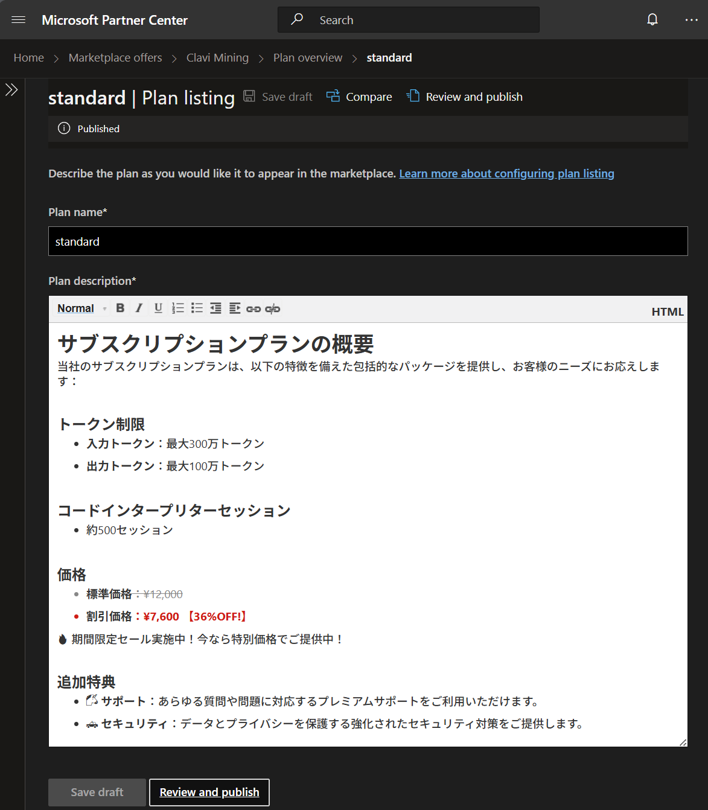
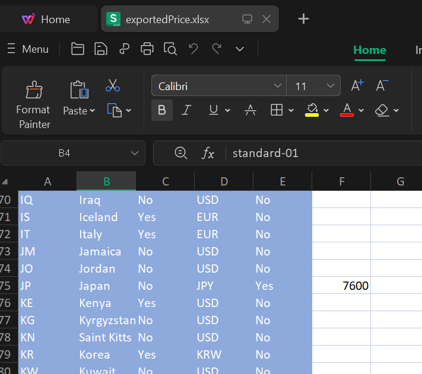
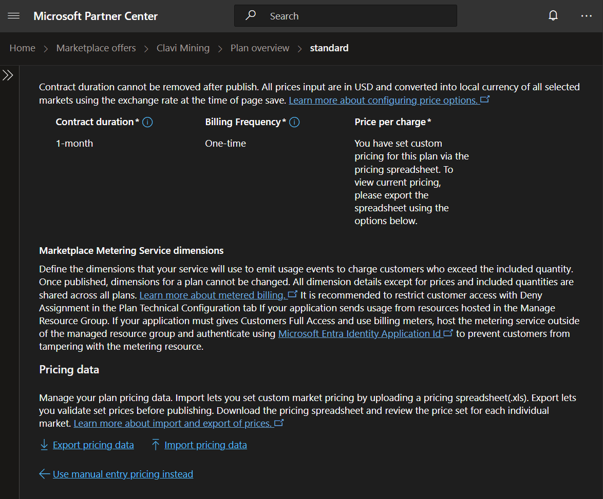

Create Offer in Partner portal.

📌: `Home` > `Marketplace offers` > `[APP NAME]` > `Plan overview` > `[PLAN NAME]`

➡️ `Plan listing`
<details>
    <summary>See image plan's description</summary>


</details>

<details>
  <summary>See html plan's description</summary>

  ### Html
  ```html
<div>
  <h1>サブスクリプションプランの概要</h1>
  <div>当社のサブスクリプションプランは、以下の特徴を備えた包括的なパッケージを提供し、お客様のニーズにお応えします：</div>
</div>
<div><br></div>
<h5><b>トークン制限</b></h5>
<ul>
  <ul>
    <li><b>入力トークン</b>：最大300万トークン</li>
    <li><b>出力トークン</b>：最大100万トークン</li>
  </ul>
</ul>
<div><br></div>
<h5>コードインタープリターセッション</h5>
<ul>
  <ul>
    <li>約500セッション</li>
  </ul>
</ul>
<div><br></div>
<h5>価格</h5>
<ul>
  <ul>
    <li style="text-decoration: line-through; color: rgba(136, 136, 136, 1)"><b>標準価格</b>：¥12,000</li>
    <li style="color: rgba(213, 0, 0, 1); font-weight: bold"><b>割引価格</b>：¥7,600 <span style="color: rgba(213, 0, 0, 1); font-weight: bold">【36%OFF!】</span></li>
  </ul>
</ul>
<div style="color: rgba(213, 0, 0, 1); font-weight: bold">
  <p>🔥 期間限定セール実施中！今なら特別価格でご提供中！</p>
</div>
<div><br></div>
<h5>追加特典</h5>
<ul>
  <ul>
    <li>🦄 <b>サポート</b>：あらゆる質問や問題に対応するプレミアムサポートをご利用いただけます。</li>
    <li>🚓 <b>セキュリティ</b>：データとプライバシーを保護する強化されたセキュリティ対策をご提供します。</li>
  </ul>
</ul>
  ```
</details>

</br>

➡️ `Pricing and availability`

* Select **Marketes**
  * sample: *Japan*
* Select **Pricing**
  * sample: *Flat rate*
* Config **Pricing Data**
  * Set ***Price per change*** to any 
  * Click ***Save draft***
  * Click ***Export pricing data***
  * Change ***exportedPrice.xlsx***
    * In available market ex. *japan* set prices to for example *7600* yen
    * Save changed
  * Click ***Import pricing data***
  * Select ***exportedPrice.xlsx*** that has been changed

<details>
    <summary>See configuration pricing</summary>



</details>